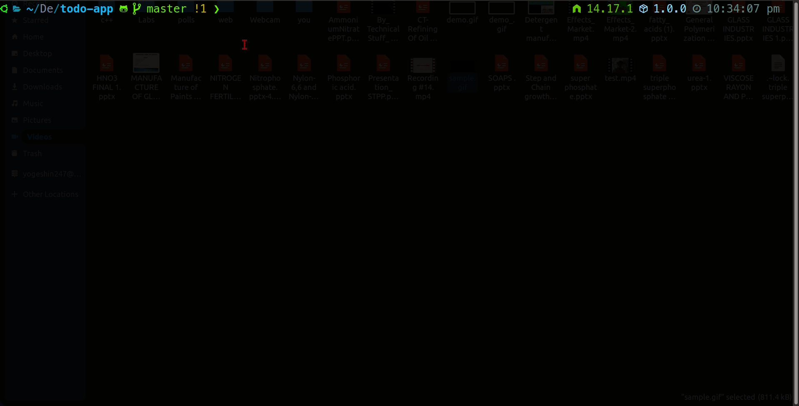

# Todo Application

Simple Todo app - backend with Python and CLI with Node.js without any frameworks.

## Usage

clone this repository

### Backend

Backend API is powered with python without any Frameworks

```python
python run_api.py
```

### CLI

CLI is powered with node.js without any external library



## API Methods

### Get all Todos

Method: GET

```url
/todos
```

### Add Todo

Method: POST

```url
/add
```

JSON data to post

```json
{
    task: 'task_name',
    is_done: false,
}
```

### Change task is done

Method: GET

```url
/done?id={task_id}
```

### Delete task

Method: GET

```url
/delete?id={task_id}
```
